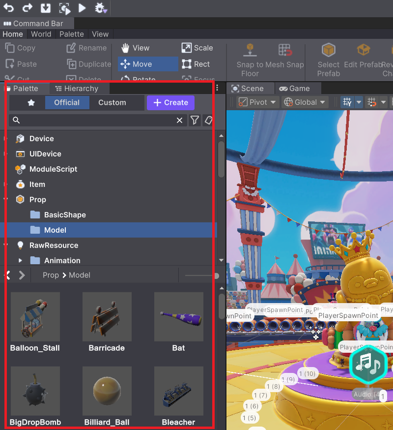
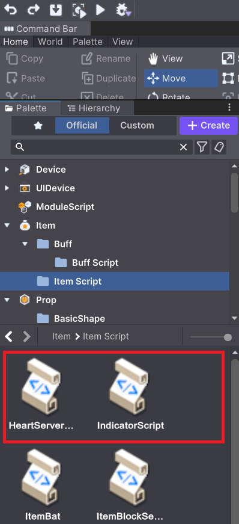
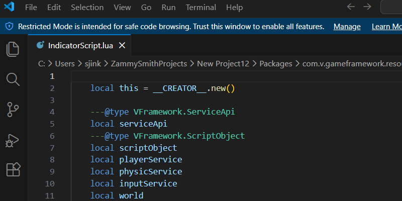
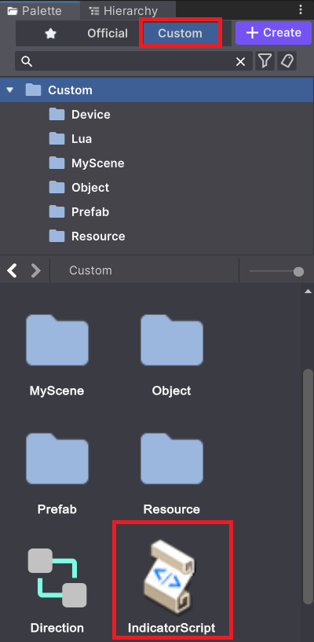
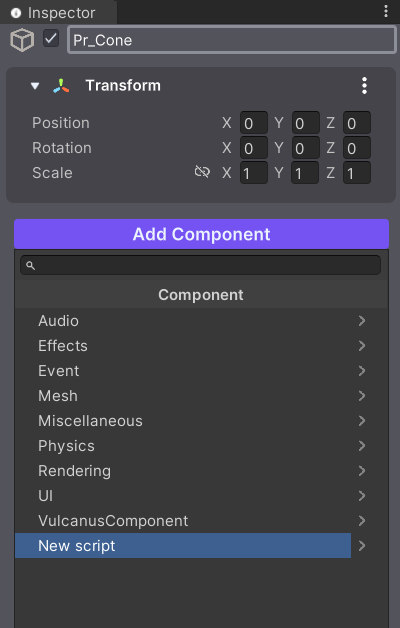
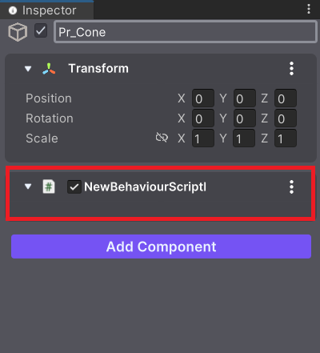
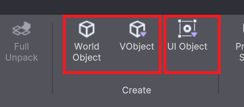
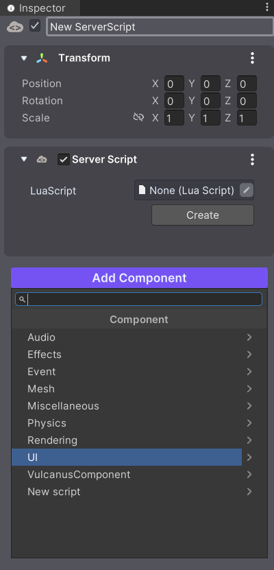

# 사용시 유의 사항

재미스미스를 사용할때 별도로 주의를 기울여야 할 부분을 안내합니다.  

차후 개발 과정에서 지속적으로 불편사항을 개선해 나갈 예정입니다. 지금은 아래 기술된 주의 사항을 유념하여 사용해 주시기를 부탁 드립니다.

## 사용할 수 있는 리소스

### 1. 팔레트의 리소스만 사용할 것

재미스미스는 창작자의 편의를 위해 자유롭게 사용 가능한 리소스를 포함하여 제공합니다.  

단 재미스미스에서 사용이 가능한 리소스는 에디터의 **팔레트에서 확인이 가능한 리소스로 제한됩니다.**

재미스미스가 제공하는 다른 리소스들은 재배포 권한을 보장하지 않습니다. 따라서 팔레트에서 확인할 수 없는 리소스를 사용할 경우 향후 MOD의 서비스에 문제가 될 수 있습니다.

또 팔레트에서 확인할 수 없는 리소스들은 재미스미스가 업데이트될 때 예고 없이 변경, 삭제될 수 있습니다.  

외부 리소스의 사용은 자유롭게 하셔도 됩니다. 다만 사용하실 경우 팔레트의 Custom폴더 하단에 끌어놓아 노출 시킨 후 사용하시기 바랍니다.

팔레트에 대해서는 아래 링크에서 더 자세한 정보를 얻을 수 있습니다.

- [Palette](https://developers-zammysmith.onstove.com/ko/Begin-ZAMMYSMITH/ZAMMYSMITH-Overview/Palette)

### 2. 유니티 에셋 셀렉터 사용시 주의할 점

일부 컴포넌트에서는 유니티 에셋 셀렉터를 통해 에셋을 직접 선택할 수 있습니다. 이때는 사용 권한이 보장되지 않는 리소스까지 모두 노출되는 경우가 있습니다.  

유니티 에셋 셀렉터로 에셋을 선택하는 경우에는 Official 폴더 내의 리소스만 사용이 가능 합니다.

더 자세한 내용은 로우 리소스 항목을 확인 하세요.

- [리소스 확용하기](https://developers-zammysmith.onstove.com/ko/Begin-ZAMMYSMITH/ZAMMYSMITH-Overview/Using-Resources)

## 팔레트 Official 위치에서 Script 변경 불가

팔레트의 Official 위치에 제공되는 Script 파일들이 있습니다.

이 Script 파일을 더블클릭하여 오픈하면 연결된 편집기에서 정상적으로 오픈 됩니다.  

창작자는 당연히 수정과 적용이 가능할 것으로 생각하기 쉽습니다.

더블 클릭하여 오픈하면

위 그림과 같이 연결된 편집기가 실행 됩니다.

하지만 팔레트의 Official 탭에 재공된 스크립트를 직접 수정하면 내용을 변경해도 MOD에 적용이 되지 않습니다.  

제공된 Script를 변경하고자 하실 때는 항상 **Save As Custom 하여 Custom폴더로 이동한 후에 변경하시기 바랍니다.**

## 컴포넌트를 추가하여 C# 사용 금지

유니티의 스크립트 컴포넌트를 추가하여 C# 스크립트를 작성하는 방식이 아직 허용되고 있습니다.  

하지만 이 방식으로 기능을 구현하는 경우 정상 동작하지 않습니다.  

에디터 상에서는 정상 동작하는 것으로 보일 수 있지만 실제 출판물에서는 동작하지 않습니다.

기능을 구현할 때는 재미스미스가 제공하는 Lua script를 사용해야 합니다.

  

위와 같이 C# 스크립트를 추가하여 구현해도 기능이 적용되지 않습니다.

## World Object와 UI Object의 사용

재미스미스의 오브젝트는 크게 World(씬)에서 사용되는 Object와 UI에 사용되는 Object로 나뉩니다.

커맨드 바의 World Object 와 Vobject로 추가할 수 있는 오브젝트는 월드(씬)에서 사용됩니다.  

커맨드 바의 UI Object로 추가할 수 있는 오브젝트는 UI에 사용됩니다.

오브젝트에는 Add Component 기능을 통해 제한 없이 컴포넌트를 추가 할 수 있습니다.

하지만 Object의 동작 환경에 맞지 않는 컴포넌트를 추가하는 경우 정상 동작하지 않습니다.

아래 링크를 통해 더 자세한 내용을 확인할 수 있습니다.

- [VObject](https://developers-zammysmith.onstove.com/ko/Unique-elements-of-ZAMMYSMITH/VObject-Overview)
