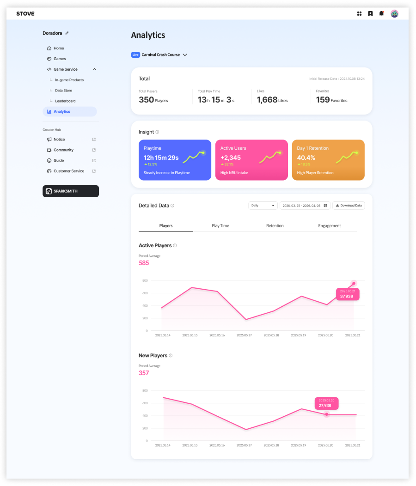
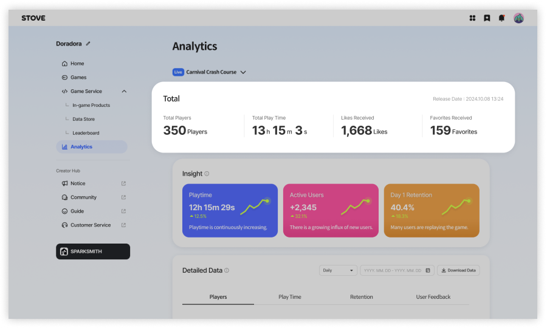
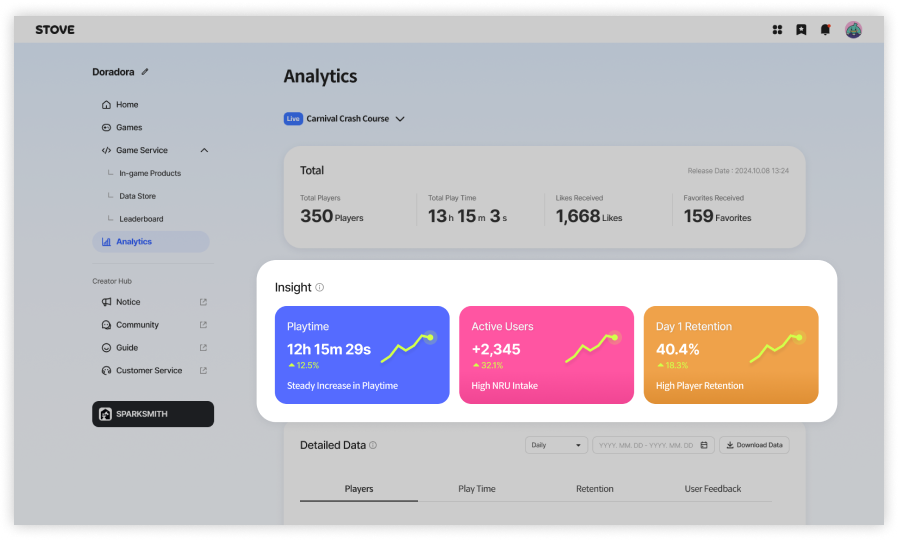
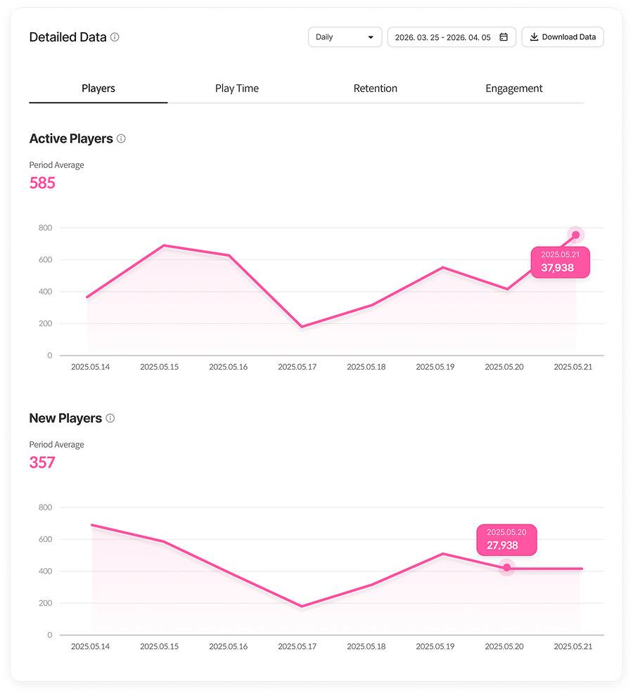

# 분석

**출시된 게임의 플레이 현황과 주요 성과 데이터를 확인할 수 있습니다.**  

플레이어 유입부터 플레이 시간, 리텐션까지 게임 운영에 필요한 핵심 지표를 한 화면에서 확인할 수 있습니다.

---

## 누적 지표

게임 출시 이후 현재까지의 **누적 성과**를 확인할 수 있습니다.

- **총 플레이어 수**
- **총 플레이 시간**
- **좋아요 수**
- **즐겨찾기 수**

※ 누적 지표는 게임 출시 시점을 기준으로 집계됩니다.

---

## 인사이트 요약

최근 데이터 흐름을 기반으로 게임 상태를 한눈에 파악할 수 있는 요약 카드입니다.

- **플레이 타임**
- **활성 유저 수**
- **Day 1 리텐션**  

각 카드에는 최근 변화 추이와 간단한 해석 문구가 함께 표시됩니다.

※ 집계 데이터가 낮은 경우, 노출되지 않을 수 있습니다.

---

## 상세 데이터

선택한 기간과 단위에 따라 게임 데이터 그래프로 일자별 변화 추이와 패턴을 확인할 수 있습니다.

### 데이터 조회 옵션 및 제공 항목

#### 조회 옵션

| 항목 | 설명 |
| --- | --- |
| 기간 선택 | 일, 주, 월 단위 기간을 설정하여 데이터를 조회할 수 있습니다. |
| 데이터 다운로드 | 선택한 기간의 데이터를 엑셀 파일로 다운로드할 수 있습니다. |

#### 제공 항목

| 항목 | 설명 |
| --- | --- |
| 플레이어 수 (Players) | 기간별 게임 플레이 유저 수 (AU, NRU) |
| 플레이 시간 (Play Time) | 기간별 플레이 시간 |
| 리텐션 (Retention) | 내 게임을 다시 플레이한 유저 비율 (D+1, D+7) |
| 유저 피드백 (User Feedback) | 내 게임에 반응한 수 (좋아요, 즐겨찾기) |

## 데이터 활용 안내

- 모든 분석 데이터는 **UTC 0시 일 단위로 갱신**되어 표시됩니다.
- 플레이 데이터를 통해 내 게임 운영 및 업데이트 방향 설정에 보조 지표로 활용할 수 있습니다.
- 데이터는 실제 내 게임을 플레이한 유저 데이터를 기준으로 집계됩니다.
- 일부 데이터는 집계 기준에 따라 지연되어 반영될 수 있습니다.
