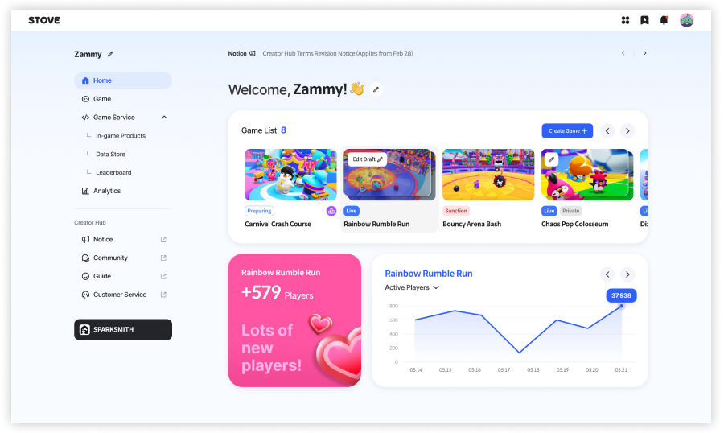
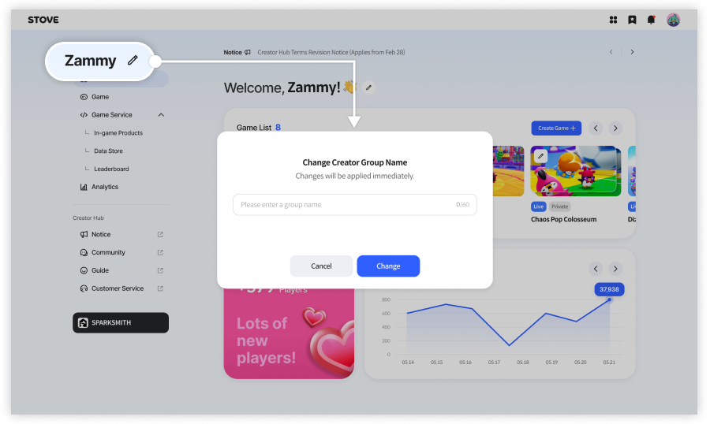
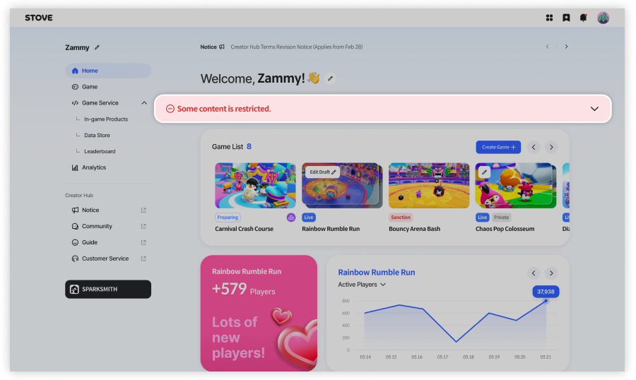
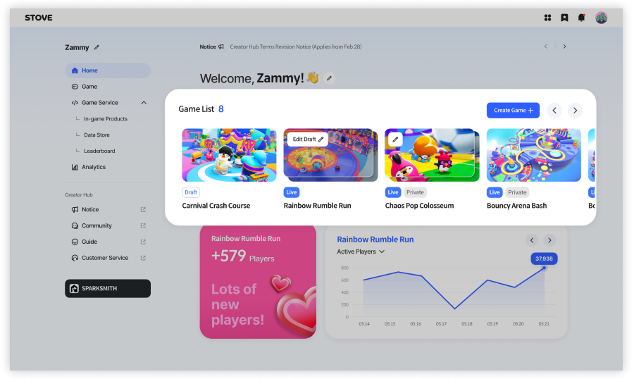
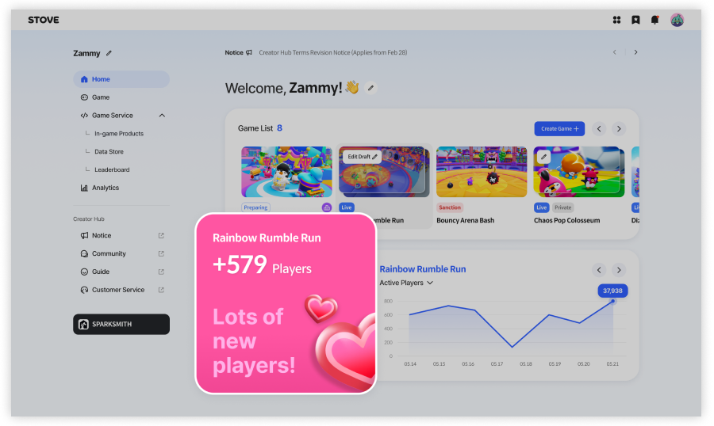
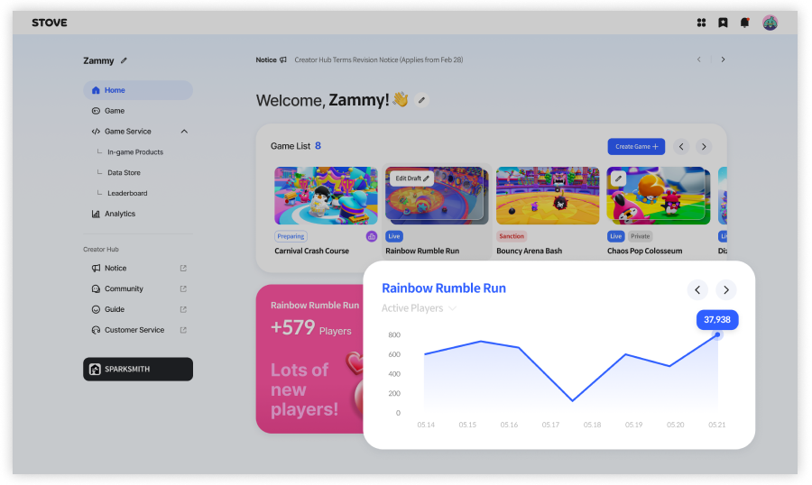

# 홈 대시보드

> 💡 이 문서는 대시보드의 주요 구성을 안내합니다.

대시보드에서는 다음과 같은 정보를 확인할 수 있습니다.

- 크리에이터 그룹에서 만든 게임 목록
- 게임 운영 상태 및 주요 성과
- 게임 제작 및 관리로 이동하는 주요 기능  

  

---

## 크리에이터 그룹

- 내가 속한 **크리에이터 그룹 정보**가 표시됩니다.
- **편집 버튼**을 눌러 그룹명을 변경할 수 있습니다.
- 그룹 멤버를 초대하여 함께 개발할 수 있습니다.  

  

※ 그룹 멤버 초대 기능은 **추후 업데이트될 예정**입니다.

---

## 알림 영역 (제한/공지)

- 크리에이터 그룹 또는 게임에 적용된 **제한 사항**이 있는 경우 안내 메시지가 표시됩니다.
- 게임 출시 제한, 게임 노출 제한 등의 상태를 확인할 수 있습니다.
- 제한 사유 및 조치 방법은 안내된 링크를 통해 확인할 수 있습니다.  

  

※ 제한 사항이 없는 경우 해당 영역은 표시되지 않습니다.

---

## 게임 목록

- 크리에이터 그룹에서 개발한 게임 목록이 표시됩니다.
- 각 게임을 선택하면 해당 게임의 관리 페이지로 이동할 수 있습니다.
- 아직 개발중인 게임이 없는 경우, 게임 만들기 버튼을 통해 스파크스미스 에디터를 바로 실행할 수 있습니다.  

  

---

## 인사이트 요약

- 운영 중인 게임의 주요 성과가 요약되어 표시됩니다.
- 다음과 같은 정보가 제공될 수 있습니다.
  - 플레이어 수 변화
  - 플레이 시간
  - 리텐션 등  

  

※ 성과 데이터가 있는 경우에만 표시됩니다.

---

## 게임 플레이 지표

- 게임별 주요 지표를 그래프와 수치로 확인할 수 있습니다.
- 활성 유저, 신규 유저, 플레이 추이 등의 정보를 확인할 수 있습니다.  

  

※ 데이터가 없는 경우 일부 지표는 표시되지 않을 수 있습니다.
