# 게임 출시 관리

게임 목록은 **개발 중이거나 라이브 출시된 게임을 관리**할 수 있는 공간입니다.  

내가 개발한 게임 목록을 확인하고, 게임 상태에 따라 수정·출시·운영 관리를 진행할 수 있습니다.

## 게임 목록

- 내가 개발한 게임의 목록이 표시됩니다.
- 각 게임에는 현재 **게임 상태**가 함께 표시됩니다.
- 게임을 선택하면 해당 게임의 상세 관리 페이지로 이동해 정보를 수정하거나 **출시** 할 수 있습니다.

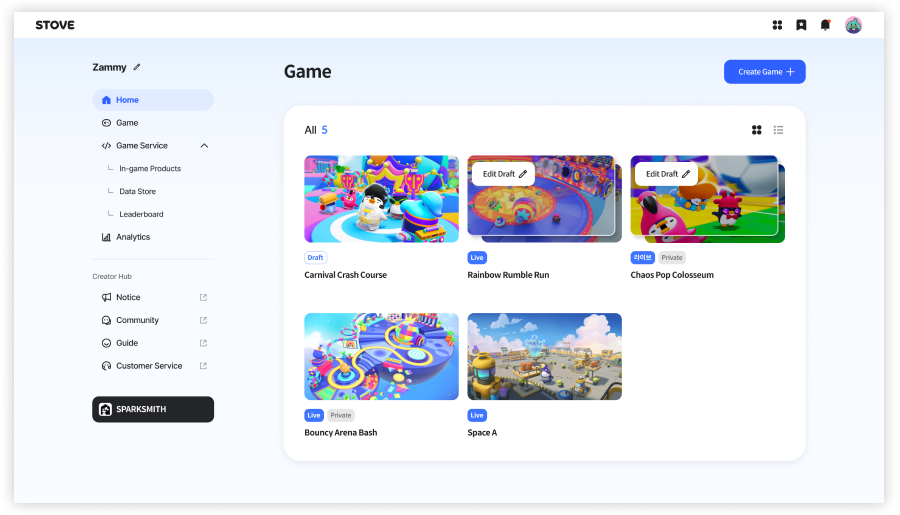

> 💡 **Tip**  
>
> 게임 목록은 **카드형 또는 리스트형**으로 확인할 수 있습니다.  
>
> 보기 방식을 전환하여 게임 상태와 정보를 더 편리하게 확인해 보세요.  
>
> 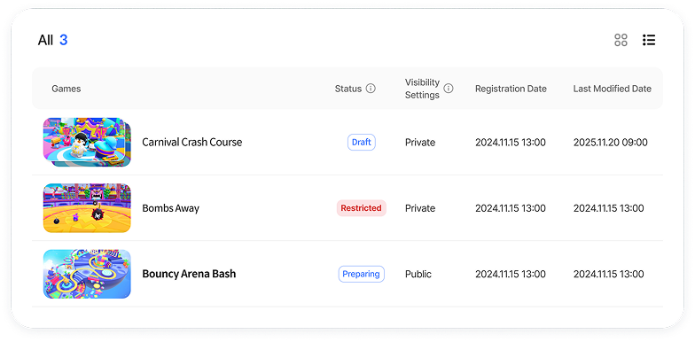

## 게임 상태 안내

게임의 상태는 다음 네 가지로 구분됩니다.

| 상태 | 설명 |
| --- | --- |
| 준비중 | 출시 전 상태의 게임입니다. |
| 라이브 | 출시가 완료되어 실제로 플레이 가능한 상태입니다. |
| 업데이트 준비중 | 라이브 상태인 게임의 업데이트 버전을 준비 중인 상태입니다. |
| 제재 | 출시된 게임에 문제가 발생하여 제재된 상태입니다. |

> 💡 **Tip** **게임이 보이지 않나요?**  
>
> 재미스미스에서 **프로젝트와 게임 아이디를 연동**하거나 **빌드를 출판**하면 게임 목록에 **준비중 상태**로 노출됩니다.

## 게임 출시 과정

게임을 출시하기 위해서는 다음 과정을 거쳐야 합니다.

### 1. 재미스미스에서 빌드 출판하기

- 재미스미스에서 게임 빌드 후, 출판합니다.
- 재미스미스에서 빌드 출판 방법은 아래 가이드를 참고해 주세요.  

  
[빌드와 출판 과정 바로가기👉](https://developers-zammysmith.onstove.com/ko/Begin-ZAMMYSMITH/ZAMMYSMITH-Overview/Publish/Build-and-publishing-process)

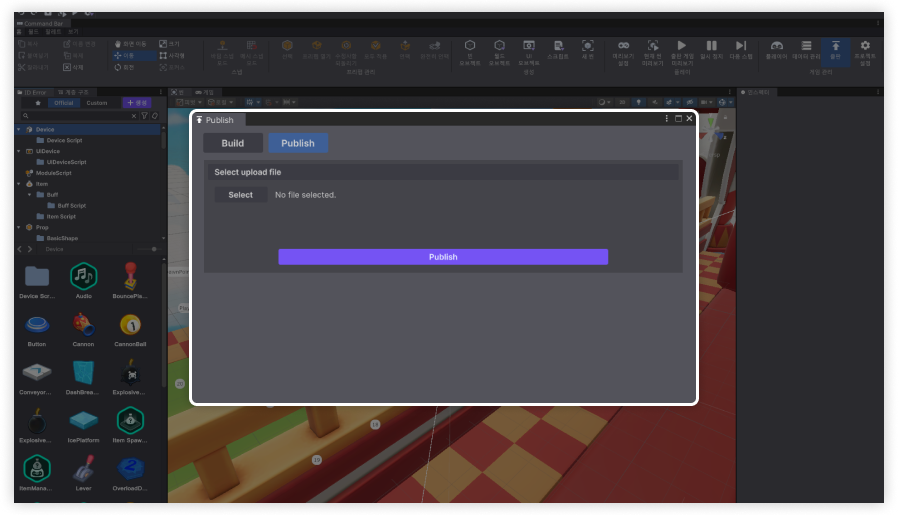

### 2. 게임 제목과 설명 등록하기

- 빌드 업로드가 완료되면 게임의 **제목과 설명**을 입력합니다.
- 제목과 설명은 크리에이터 허브에서 언제든지 수정할 수 있습니다.
- 등록을 완료하면 **크리에이터 허브 웹페이지**로 이동합니다.

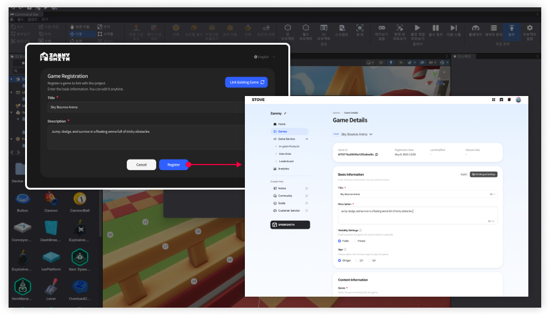

> 💡 **Tip** 출시 전 게임을 테스트 하기  
>
> 재미스미스 에디터에서 게임 등록을 완료했다면, 버블리즈 내 게임 목록에서 테스트할 수 있습니다.  
>
> 크리에이터 허브에서 게임을 출시하기 전에, 다른 사람들과 내 게임을 테스트 해보세요.

내 게임을 다른 사람들과 테스트하는 법

1. 함께하기 버튼을 선택합니다.  

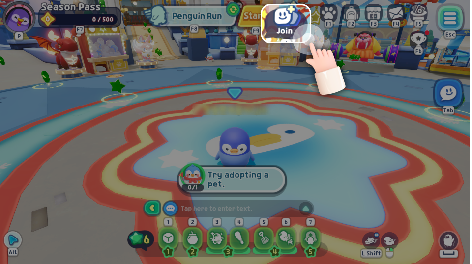

2. 그룹 만들기를 선택합니다.  

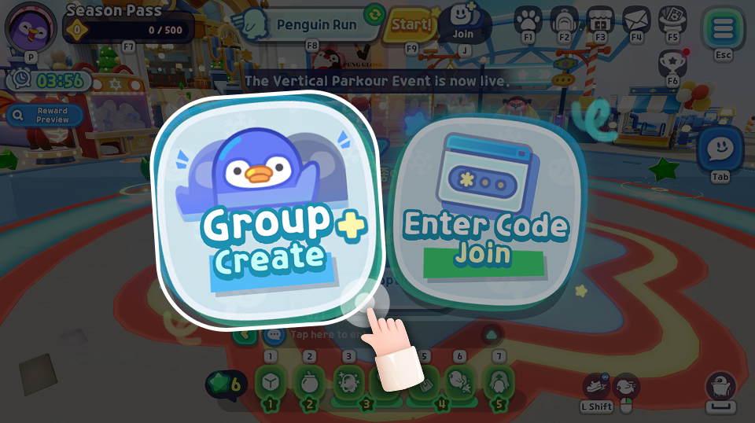

3. 그룹에서 게임 변경하기를 선택합니다.  

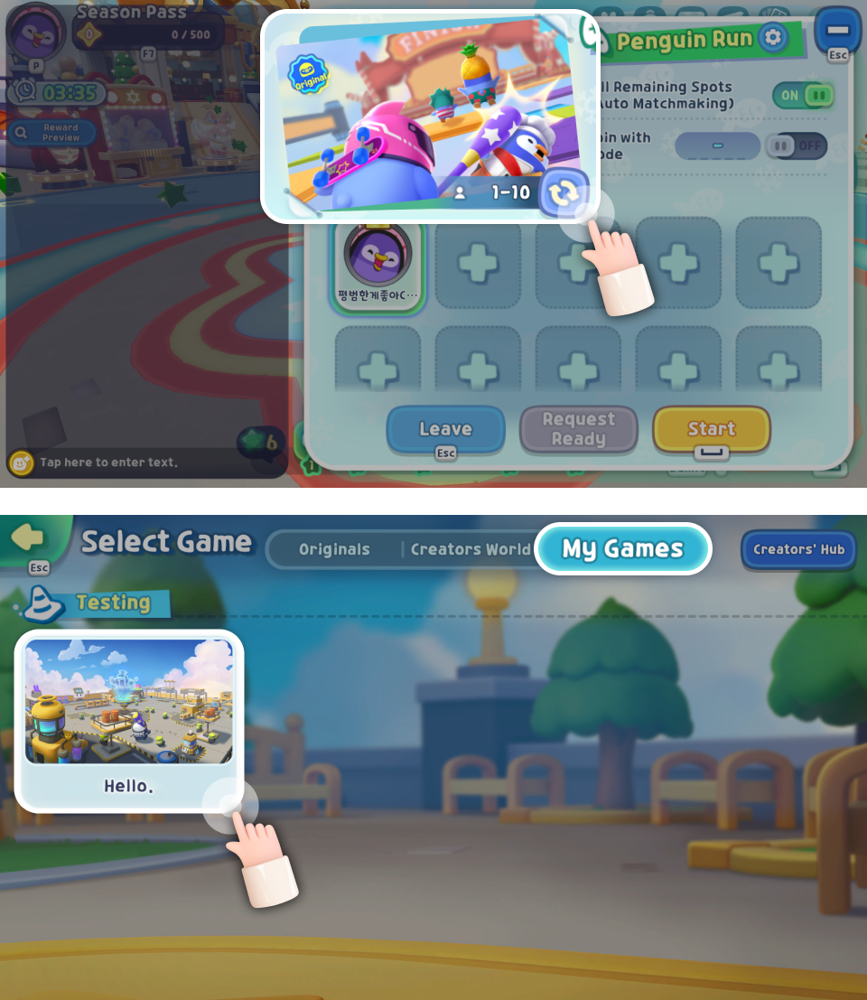

4. 내 게임에서 테스트할 게임을 선택합니다.  

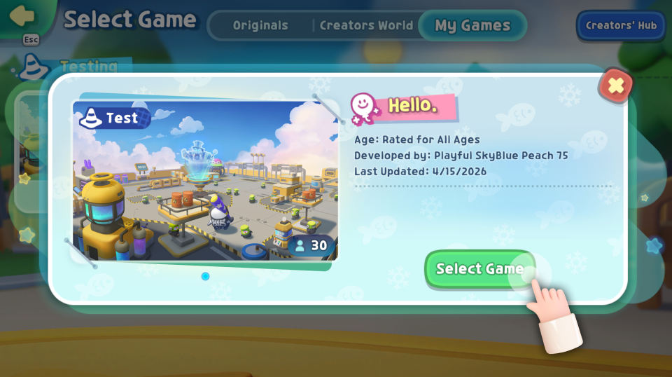

1. 그룹에서 내 게임을 같이 테스트할 친구들을 초대해 게임 테스트를 시작합니다.  

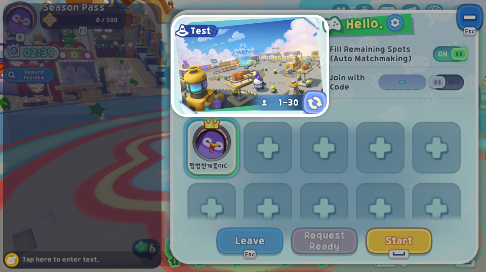

### 3. 게임 정보 입력하기

- 게임 스크린샷과 장르 등 내 게임에 대한 주요 정보를 입력한 후, 출시를 완료합니다.

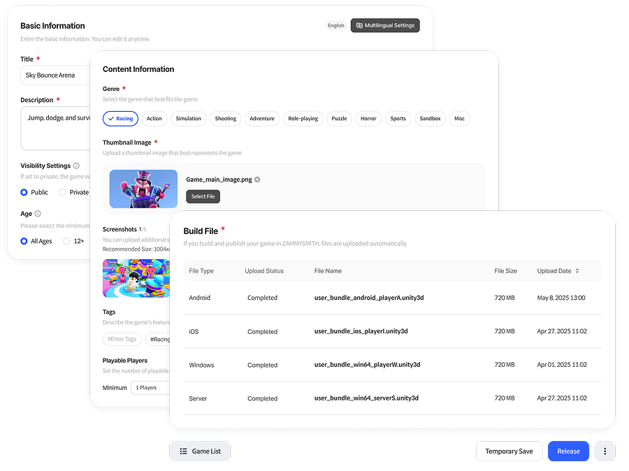

> 💡 **Tip**  
>
> 게임 출시 전, 설문을 통해 내 게임의 콘텐츠 수위 정보 확인이 필요해요.  
>
> 설문을 진행하지 않으면, 게임을 출시할 수 없으니 꼭 진행해 주세요.  
>
> 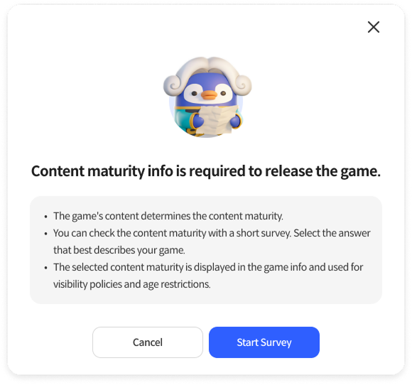

### 4. 내 게임 전시

- 출시가 완료되면, 라이브 상태로 변경되고 버블리즈 크리에이터 게임 목록과 공식 홈페이지에 자동으로 전시됩니다.
- 다른 사람들이 내 게임을 언제든지 자유롭게 플레이할 수 있습니다.

> 💡 **Tip**  
>
> 게임 기본정보에서, 공개설정 옵션을 통해 게임 출시 상태와 관계 없이 전시 여부를 설정할 수 있습니다.  
>
> 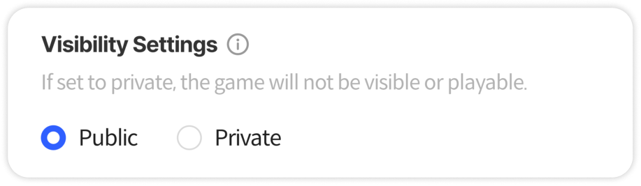
