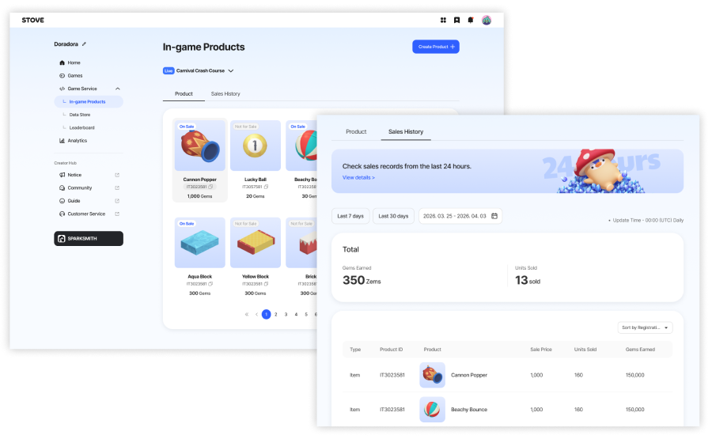
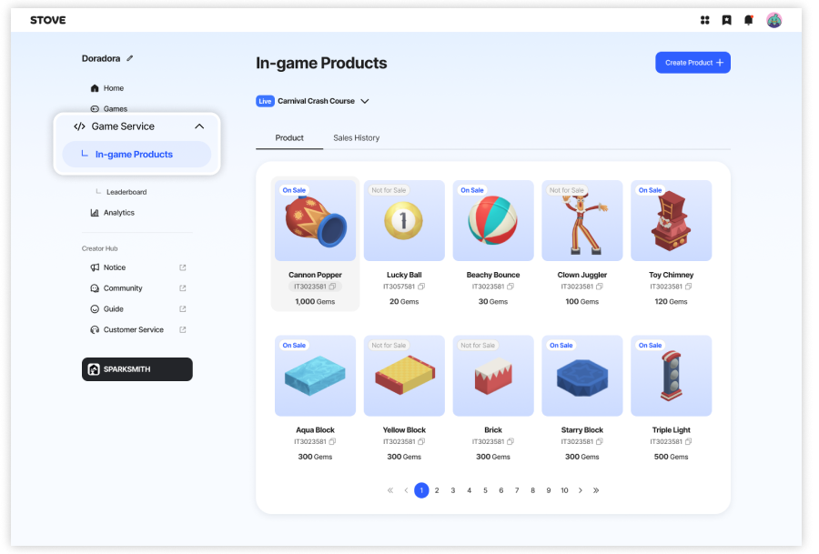
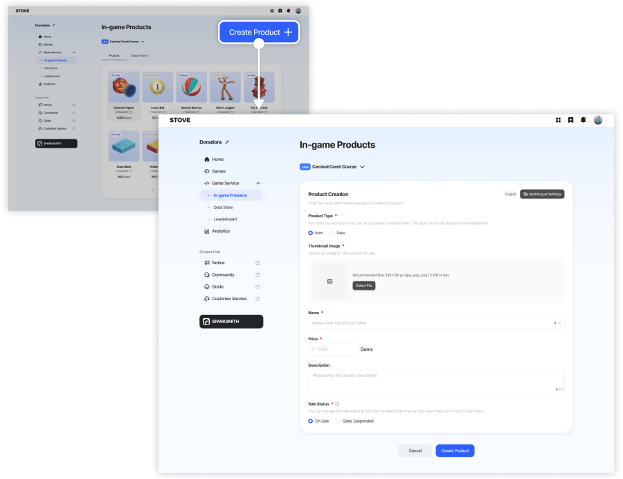
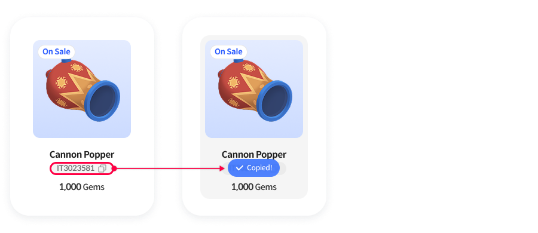
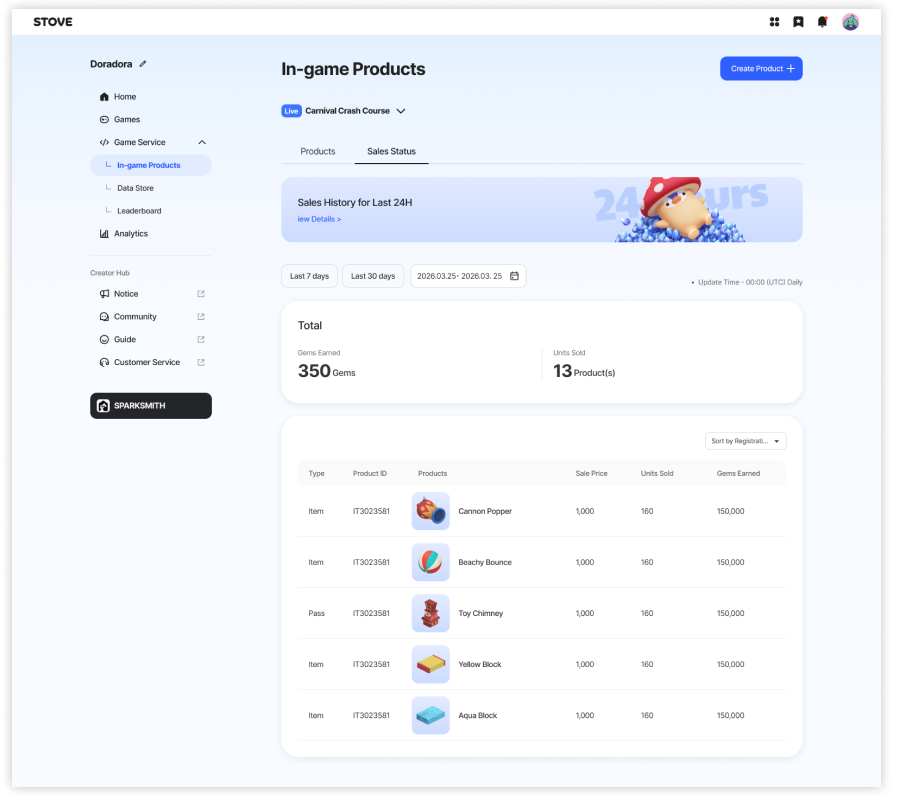
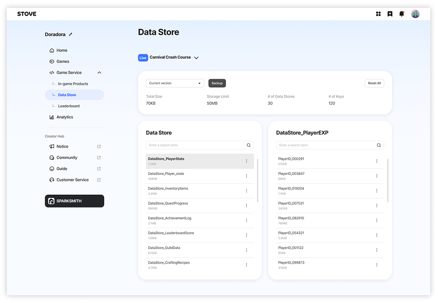
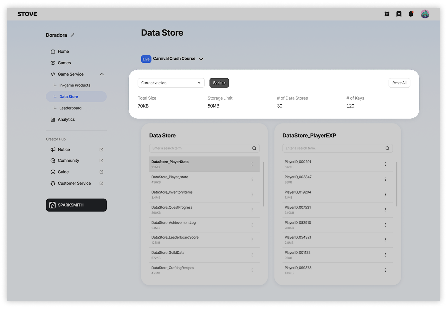
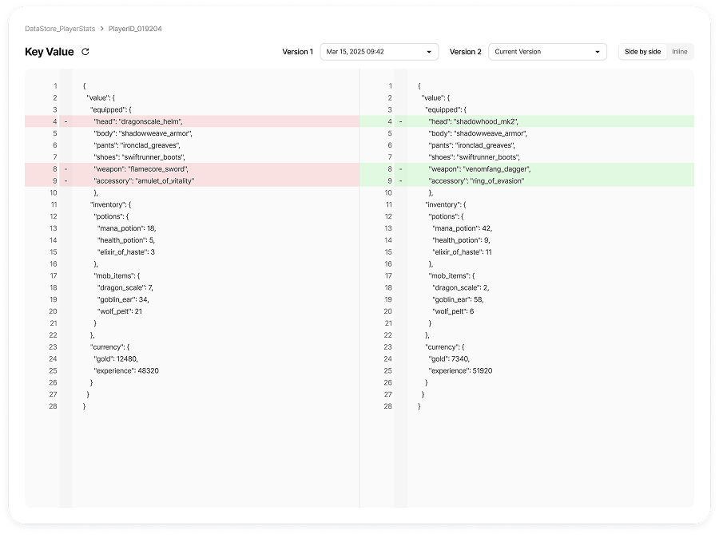
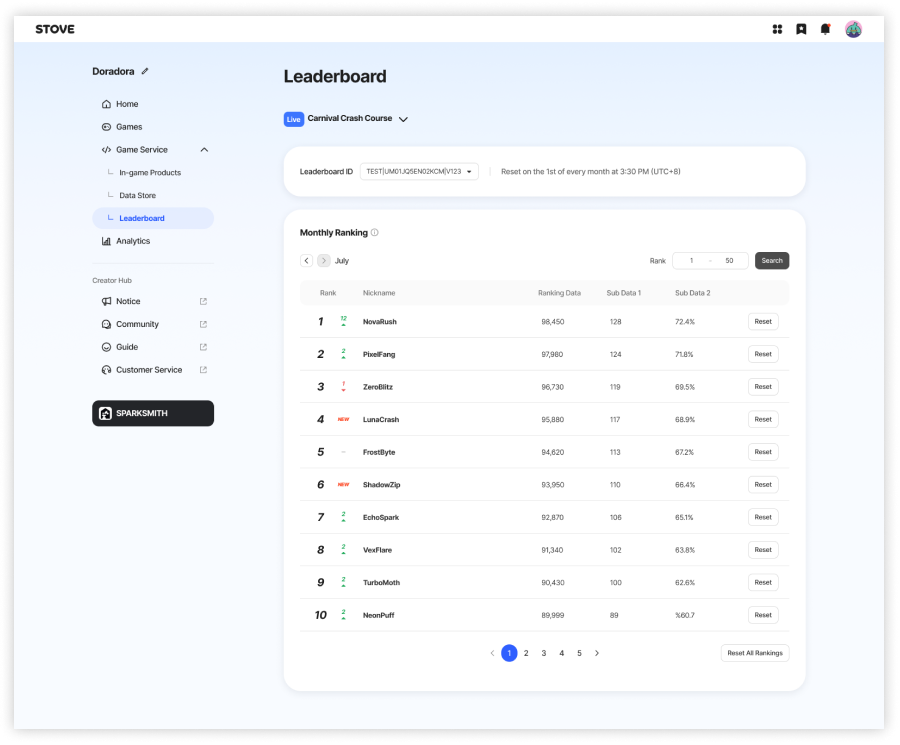
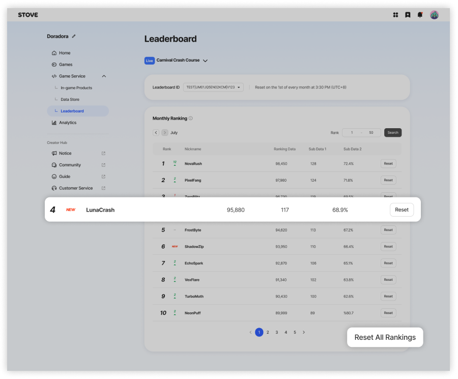

# 게임 서비스

## 인게임 상품

인게임 상품에서는 내 게임 상점에서 판매할 상품을 등록하고, 상품 판매 내역을 확인할 수 있습니다.

---

### 상품 등록 과정

상품을 등록하기 위해서는 다음 과정이 필요합니다.

#### 1. 개발자 상품 메뉴 이동

- **재미스미스** 또는 **크리에이터 허브**의 게임 서비스의 개발자 상품 메뉴로 이동합니다.
- 프로젝트와 게임 아이디가 연동되어 **내 게임이 준비중이거나 라이브 출시 상태인 경우에만 상품을 등록할 수 있습니다.**

#### 2. 상품 등록하기

- **상품 등록 버튼**을 눌러 등록 페이지로 이동합니다.
- 상품 이미지와 기본 정보를 입력한 후 등록을 완료합니다.

#### 3. 아이템 아이디 복사하기

- 상품 등록이 완료되면 **상품 아이디(Product ID)** 가 발급됩니다.
- 발급된 상품 아이디를 사용해 내 게임 상점에서 판매할 상품을 개발할 수 있습니다.  

상품 개발 방법에 대한 자세한 내용은 아래 가이드를 참고해 주세요.  

[인게임 상품과 상점 만들기 👉](https://developers-zammysmith.onstove.com/ko/Editor-Feature-Info/Creating-in-game-products)

#### 4. 상점 개발 완료 후 게임 출시하기

- 재미스미스에서 상점 개발을 완료한 후 **출판**을 진행합니다.
- 크리에이터 허브에서 게임 출시를 완료하면 다른 플레이어들이 내 게임 상점에서 아이템을 구매할 수 있습니다.  

출판과 출시 방법에 대해서는 아래 게임 출시 관리 가이드를 참고해 주세요.  

[게임 출시 관리 👉](game_release.md)

> 💡 **Tip - 구매 테스트**  
>
> 버블리즈 게임에 접속한 후, 내 게임 목록에서 **아이템 구매 테스트**를 할 수 있습니다.
>
> - 게임이 **준비중 상태**일 때 테스트 구매가 가능합니다.
> - 테스트로 구매한 아이템 거래 이력은 **테스트 내역**에서 확인할 수 있습니다.  
>
> 내가 만든 아이템이 정상적으로 거래되는지 꼭 확인해 보세요.

### 판매 내역 확인하기

- 내 게임 상점에서 거래된 **아이템 판매 이력**을 확인할 수 있습니다.
- 최근 24시간 이내 판매 내역이 있는 경우 안내 배너를 눌러 바로 확인할 수 있습니다.

※ 아이템 판매 수익 정산 기능은 **추후 업데이트 예정**입니다.  

※ 게임 매출 수익 분석은 **별도 분석 메뉴**로 제공될 예정입니다.

---

## 데이터 스토어

데이터 스토어는 **내 게임에서 사용되는 플레이 데이터를 조회하고 관리하는 메뉴**입니다.  

게임 운영에 필요한 데이터를 직접 확인할 수 있습니다.

### 데이터 백업

- 데이터는 **3시간 간격으로 자동 저장**됩니다.
- 저장된 데이터는 **최근 14일까지만 보관**됩니다.
- **백업 버튼**을 눌러 현재 버전을 한 번에 저장할 수 있습니다.

> ⚠️ **유의사항**  
>
> 14일 이전 데이터는 복구할 수 없으니 필요한 데이터는 미리 확인해 주세요.

### 데이터 비교하기

- 스토리지에 저장된 데이터를 선택하여 **버전 간 데이터를 비교**할 수 있습니다.
- 나란히 보기 또는 인라인 보기로 데이터 변경 사항을 쉽게 확인할 수 있습니다.

---

## 리더보드

리더보드는  

**내 게임에 연동된 리더보드 데이터를 확인하고 관리하는 메뉴**입니다.

### 리더보드 데이터 확인

- 리더보드에 적재된 순위 데이터를 확인할 수 있습니다.
- 기간별 랭킹 정보를 조회할 수 있습니다.

### 리더보드 초기화

- 리더보드 데이터를 **개별 초기화**하거나 **전체 초기화**할 수 있습니다.
- 초기화 시 해당 리더보드의 순위 데이터가 리셋됩니다.

> ⚠️ **주의**  
>
> 리더보드 초기화 시 플레이어의 순위 데이터가 함께 초기화됩니다.
